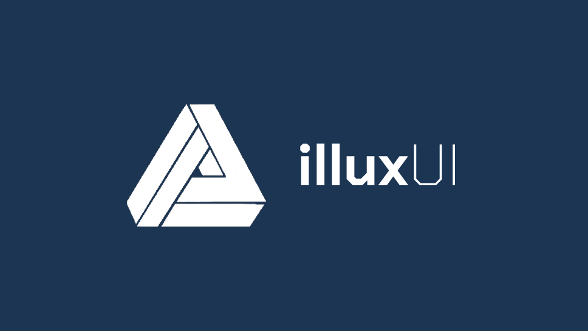

illuxUI - GUI Framework for Desktop Applications
==================================

**Overview**  
illuxUI is a C++ GUI framework designed for building desktop applications. Whether you're developing a simple single-window calculator or a complex, multi-window editor (such as a game engine editor, graphics suite, or 2D/3D content editor), illuxUI provides the tools you need to bring your interface to life.

Unlike immediate-mode GUI libraries, illuxUI follows a retained-mode architecture. This means event processing and rendering are managed internally by the GUI system, allowing developers to focus on designing user interfaces and handling user interactions without worrying about the lower-level rendering logic.

Originally developed for the **Pard Engine** editor, illuxUI has since evolved into a general-purpose GUI framework capable of supporting a wide variety of desktop applications.

---

**Key Features**

- **Retained-Mode GUI Architecture**  
  Events and rendering are managed by the system, streamlining development and reducing complexity.

- **Advanced Window Management**  
  Support for multiple windows and a fully dockable panel system enables the creation editor-like interfaces.

- **Wide Range of UI Controls**  
  Includes essential and advanced controls such as:
  - Buttons  
  - TextBoxes  
  - TreeViews  
  - ListBoxes  
  - ScrollBars  
  - MenuBars  
  - Context Menus  
  - And more

