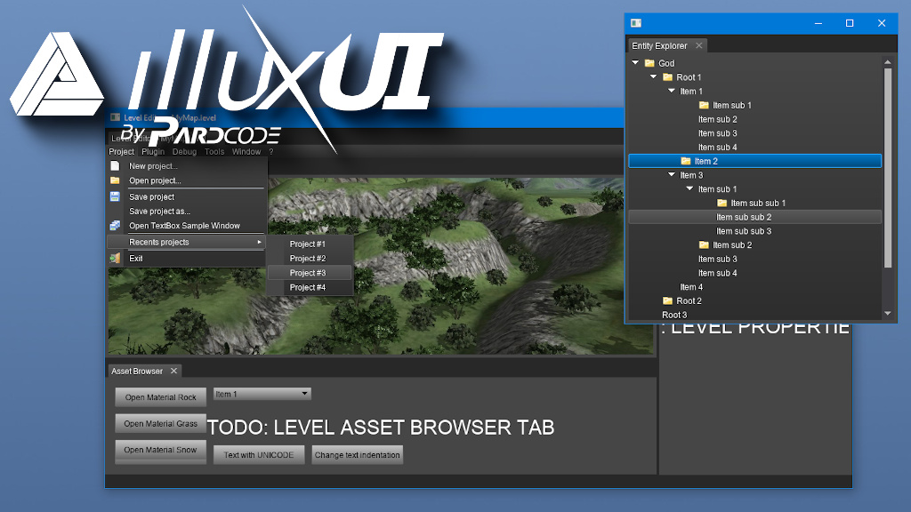

illuxUI - C++ GUI Framework
==================================

**illuxUI** is a **C++ GUI Framework** that has been designed and developed to make GUI Desktop Applications.   
It allows to develop potentially any kind of GUI Applications, from a simple single window Calculator  
to a complex multiple dockable windows Editor (e.g. Game Engine Editor, Graphics Editor, 3D/2D Editor of various nature)  
  
illuxUI is **not an immediate mode gui** library,   
that means the events processing and the rendering of the elements inside the various windows are all handled by the   
GUI System under the hood, not   
directly by the user.  
  
In this way, **the developer can focus** mainly into the making of the **GUI Layout** with the various controls   
(like Button, TextBox, TreeView, ListBox and so on)  
and the **handling of the events triggered by the controls** when the user acts on them  
(like the click on a button, the adding of text inside a textbox and so on).  
  
It has been designed and developed originally with the purpose to make the GUI for   
the editor of the game engine called **Pard Engine** and now, after many improvements, 
illuxUI can be used to build many other kinds of application.

For these reasons, **illuxUI will be soon released as a standalone framework**.

**Rendering** is accomplished by the usage of the render sub-system of Pard Engine, that has been designed to support **multiple Graphics APIs** like **OpenGL, DirectX, Metal** and so on.

### Features ###
- Multiple Windows System
- Dockable Panels System
- Many types of controls already introduced: Buttons, TextBoxes, TreeViews, ScrollBars, MenuBar, Context Menu etc.
